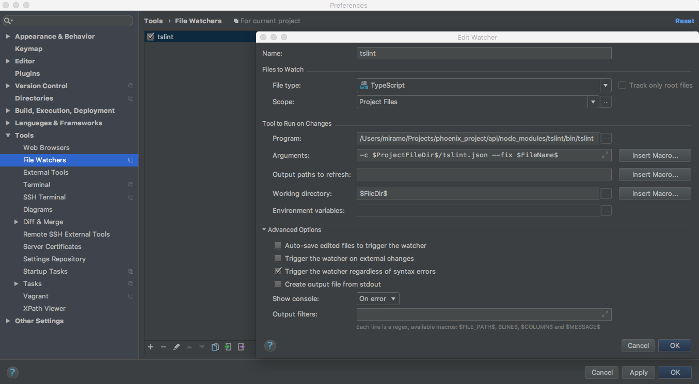
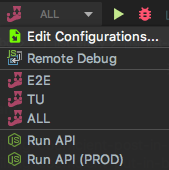
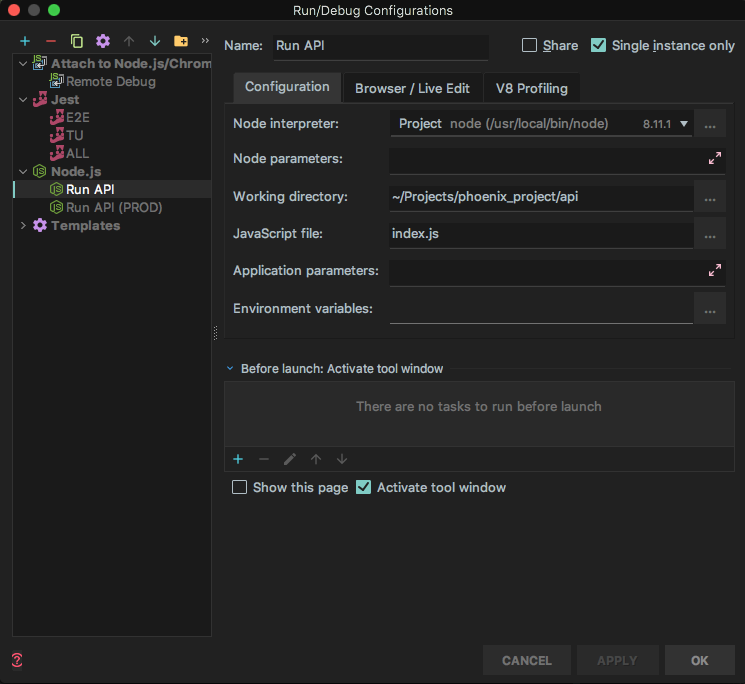
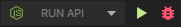
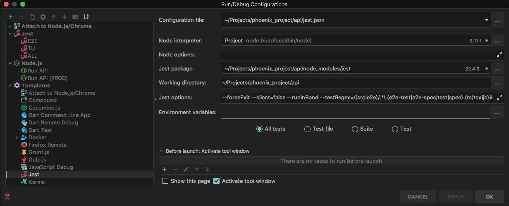
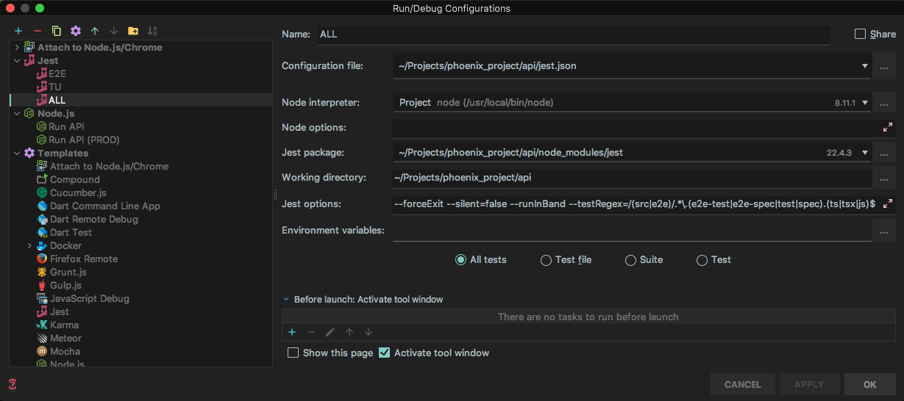
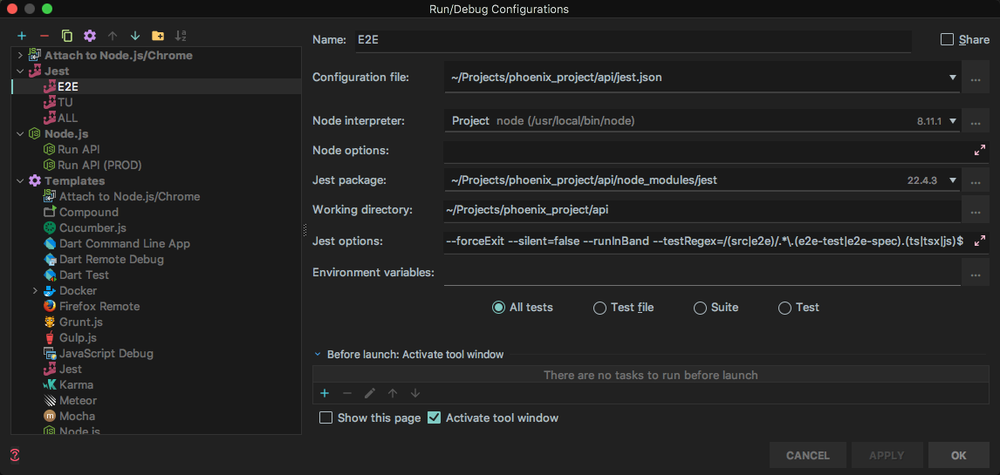
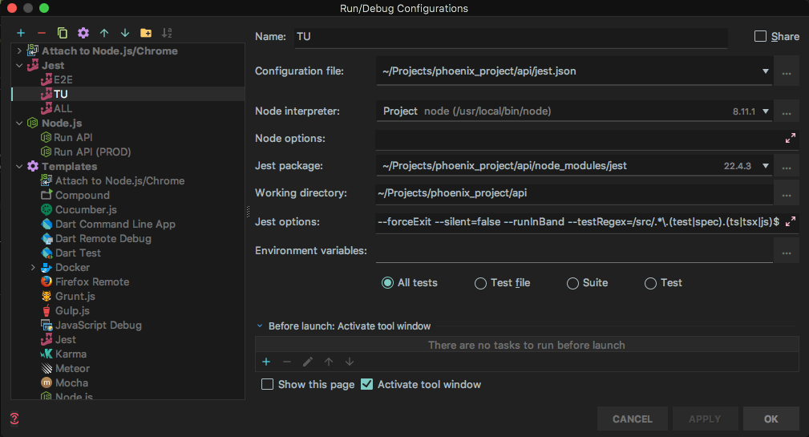
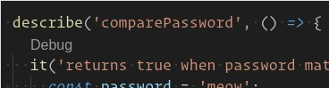

# Gojob IDE tips and configurations

*Some tips and configurations on most popular IDE.*

## Table of Contents

  1. [WebStorm](#webstorm)
  2. [Visual Studio Code](#visual-studio-code)

## WebStorm
  > **Note**: This assumes you are currently using [WebStorm](https://www.jetbrains.com/webstorm/) IDE.

  <a name="webstorm--file-watcher"></a><a name="1.1"></a>
  - [1.1](#webstorm--file-watcher) **File watcher**: Allow the IDE to reformat the code depending on `tslint.json`,after any file modification.
    > **Note**: This configuration assumes you use the TypeScript language and the [TSLint](https://palantir.github.io/tslint/) linter.

    Go to `Tools -> File Watchers`, configure a new watcher doing as follows:
    ```text
      File Type = TypeScript
      Scope = Project Files
      Program = <binary of tslint package within node_modules>
      Arguments = -c $ProjectFileDir$/tslint.json --fix $FileName$
      Working directory = $FileDir$
    ```
    

  <a name="webstorm--debugging"></a><a name="1.2"></a>
  - [1.2](#webstorm--debugging) **Debugging**:
      <a name="webstorm--debugging--debug-api"></a><a name="1.2.1"></a>
      - [1.2.1](#webstorm--debugging--debug-api) **Debug API**:

        First you need to edit your config :

        

        Then create an **Node.js** configuration as following :

        

        Now you can run API in debug mode and put breakpoints in your code.

        
      <a name="webstorm--debugging--jest"></a><a name="1.2.2"></a>
      - [1.2.2](#webstorm--debugging--jest) **Jest**:

        As described [above](#webstorm--debugging--debug-api) edit your config.

        Then create four **Jest** configuration as following :

        
        > --forceExit --silent=false --runInBand --testRegex=/(src|e2e)/.*\.(e2e-test|e2e-spec|test|spec).(ts|tsx|js)$

        
        > --forceExit --silent=false --runInBand --testRegex=/(src|e2e)/.*\.(e2e-test|e2e-spec|test|spec).(ts|tsx|js)$

        
        > --forceExit --silent=false --runInBand --testRegex=/(src|e2e)/.*\.(e2e-test|e2e-spec).(ts|tsx|js)$

        
        > --forceExit --silent=false --runInBand --testRegex=/src/.*\.(test|spec).(ts|tsx|js)$

        Now you can use this check in your code to execute jest for a specific test

        

## Visual Studio Code
  > **Note**: This assumes you are currently using [Visual Studio Code](https://code.visualstudio.com/).

  <a name="vs-code--plugins"></a><a name="2.1"></a>
  - [2.1](#vs-code--plugins) **Plugins**:
    - Recommended:
      - [Jest](https://marketplace.visualstudio.com/items?itemName=Orta.vscode-jest)
      - [TSLint](https://marketplace.visualstudio.com/items?itemName=eg2.tslint)
      - [Prettier](https://marketplace.visualstudio.com/items?itemName=esbenp.prettier-vscode)
      - [GitLens](https://marketplace.visualstudio.com/items?itemName=eamodio.gitlens)
    - Optional:
      - [Debugger for Chrome](https://marketplace.visualstudio.com/items?itemName=msjsdiag.debugger-for-chrome)
      - [Docker](https://marketplace.visualstudio.com/items?itemName=PeterJausovec.vscode-docker)
      - [DotENV](https://marketplace.visualstudio.com/items?itemName=PeterJausovec.vscode-docker)


<a name="vs-code--debugging"></a><a name="2.2"></a>
  - [2.2](#vs-code--debugging) **Debugging**:

    In order to run our **API** with the inspector, use the following debug configuration:

    ```json
    {
      "type": "node",
      "request": "launch",
      "name": "Run the API",
      "program": "${workspaceRoot}/index.js",
      "restart": true,
      "console": "integratedTerminal",
      "internalConsoleOptions": "neverOpen"
    }
    ```

    > **Note**: Node v8+ is required in order to use the (new) inspector.

    You can now put breakpoints in the TypeScript code of the project and use the debugger of VS Code.

    ___

    The easiest way to debug **Jest** tests is to use the [Jest](https://marketplace.visualstudio.com/items?itemName=Orta.vscode-jest) plugin. The way it's done at Gojob allows you to run TypeScript tests with the inspector (breakpoints are hit), without having to transpile them to JavaScript nor to build/load their sourcemaps.

    All you need to do is defining a debug configuration named `vscode-jest-tests` to allow the **Debug** option/button to work.

    ```json
    {
      "type": "node",
      "name": "vscode-jest-tests",
      "request": "launch",
      "program": "${workspaceFolder}/node_modules/.bin/jest",
      "args": [
        "--silent=false",
        "--config=jest.json",
        "--runInBand",
        "'--testRegex=/src/.*[\\.].*test[\\.](ts|js)$'"
      ],
      "cwd": "${workspaceFolder}",
      "console": "integratedTerminal",
      "internalConsoleOptions": "neverOpen"
    },
    ```
    
    > 💡 Please note the format of the regex `"'--testRegex=/src/.*[\\.].*test[\\.](ts|js)$'"`. Depending on your environment, shell, platform (etc.) you might need to escape the regular dot with such a syntax (`[\\.]`) or jest will not find any test, as the regex won't be correctly passed to it.

    Restart Visual Studio Code and use the **Debug** link above Jest tests. Breakpoints can be used too :tada:

    **NB**: Adapt the configuration to your needs and project.

    

    ___

    You don't need the Jest plugin if you want to debug the full execution of tests. Use the following VSCode configuration:

    ```json
    {
      "type": "node",
      "request": "launch",
      "name": "E2E Tests",
      "program": "${workspaceFolder}/node_modules/.bin/jest",
      "args": [
        "--silent=false",
        "--config=${workspaceFolder}/jest.json",
        "--runInBand",
        "--testRegex=/src/.*\\.e2e-test\\.(ts|js)$"
      ],
      "console": "integratedTerminal",
      "internalConsoleOptions": "neverOpen"
    }
    ```

    *Example for E2E tests. Adapt the parameters depending on the tests you need to run (unit tests, integration tests...). **--runInBand** is mandatory, no matter
    which tests you are running.*

    **Or** you can also debug the **current file** (open in the editor) with a config similar to:

    ```json
    {
      "type": "node",
      "request": "launch",
      "name": "Test (Current File)",
      "program": "${workspaceFolder}/node_modules/.bin/jest",
      "args": [
        "--silent=false",
        "--config=${workspaceFolder}/jest.json",
        "--runInBand",
        "--testRegex=/src/.*\\..*?test\\.(ts|js)$",
        "${file}"
      ],
      "console": "integratedTerminal",
      "internalConsoleOptions": "neverOpen"
    }
    ```

    ___

    To debug **Frontend** projects, use the following configuration:

    ```json
    {
      "type": "chrome",
      "request": "launch",
      "name": "Debug Webapp",
      "url": "http://localhost:3000",
      "webRoot": "${workspaceFolder}/packages/webapp/src",
    }
    ```

    *Example for a "webapp" project, located in a yarn package. Adding `src` to the `webRoot` path is essential with TypeScript code, in order for VSCode to automatically find **sourceMaps**.*


**[⬆ back to top](#table-of-contents)**
